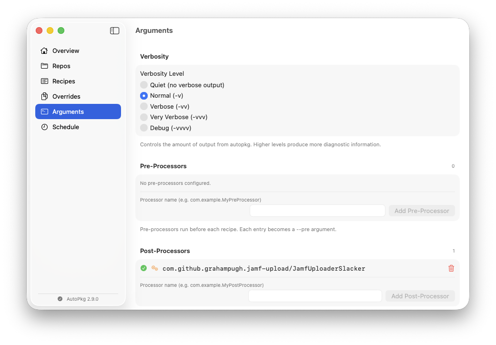
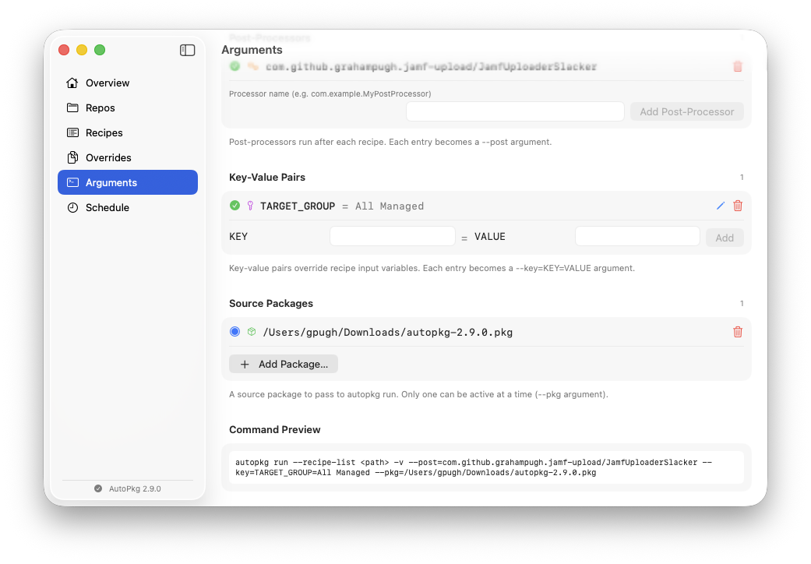

# AutoPkg Wizard

A modern macOS SwiftUI application for managing [AutoPkg](https://github.com/autopkg/autopkg). AutoPkg Wizard provides a graphical interface for common AutoPkg tasks, created with eternal love towards the venerable [AutoPkgr](https://github.com/lindegroup/autopkgr).


## Requirements

- macOS 26.0 or later
- [AutoPkg](https://github.com/autopkg/autopkg/releases) installed at `/usr/local/bin/autopkg`

## Installation

- Grab the `dmg` or `pkg` from the latest release on the [Releases](https://github.com/grahampugh/autopkg-wizard/releases) page.
- Note that the app is not currently signed or notarized. You may need to allow the app or package to be launched via System Settings > Security & Privacy.

## Features

### Overview

The landing page shows a dashboard with counts of repos, recipes, and overrides, along with the installed AutoPkg version. From here you can view and edit AutoPkg preferences stored in the `com.github.autopkg` defaults domain - add, edit, and delete key/value pairs directly.

### Repos


- View all installed AutoPkg recipe repos with their GitHub URLs
- Add repos by short name (e.g. `grahampugh-recipes`) or full GitHub URL
- Edit mode with multi-select for bulk removal
- Update all repos with real-time streaming output

### Recipes


- Manage a recipe list file (default: `~/Library/AutoPkg/recipe-list.txt`)
- Add recipes from locally available recipes, GitHub search, or manual entry
- When adding a recipe from search, the required repo is automatically added if not already installed
- Drag to reorder and edit mode with multi-select for bulk removal
- Run individual recipes or the entire list, with real-time streaming log output
- View detailed recipe info (parent recipes, processors, input values) via the info button
- Create recipe overrides directly from the recipe list
- Visual recipe type indicators (`.jamf`, `.munki`, `.download`, `.pkg`, `.install`)
- Automatic `MakeCatalogs.munki` management - added to the end of the list when `.munki` recipes are present, along with the required `autopkg/recipes` repo and override

### Overrides


- Browse existing recipe overrides from `~/Library/AutoPkg/RecipeOverrides/`
- View override file contents in a detail pane
- Verify and update trust info per override with status indicators
- Reveal override files in Finder
- Syntax-highlighted viewer for override contents with support for YAML and PLIST formats
- Edit and save overrides directly inline, with real-time validation on save.
- List edit mode with multi-select for bulk deletion

### Arguments



- Set recipe run verbosity level (default: Normal (`-v`))
- Add pre- and post-processors to be run before/after every recipe.



- Add any number of key-value pairs that will be passed as `--key value` arguments to every recipe run, with support for boolean flags (e.g. `0`/`1` or `true`/`false`)
- Add source packages that can be passed as `--pkg` arguments, which can be stored and selected for use.
- Command preview showing exactly what autopkg command will be run.

### Schedule


- Schedule automatic AutoPkg recipe runs using macOS `launchd`
- Configure run time (hour/minute) and days of the week
- Quick presets for "Every Day" and "Weekdays Only"
- Enable/disable the schedule with automatic LaunchAgent management
- View next scheduled run time, agent status, and last run time

## Building

Build using `make` from the repo root:

```bash
make              # Debug build (.app only)
make release      # Release build (.app + .pkg + .dmg + GitHub pre-release)
make clean        # Remove all build artifacts
```

The `make release` target:
1. Compiles an optimised release build via Xcode
2. Creates a macOS distribution installer package (`AutoPkgWizard-<version>.pkg`) that installs the app into `/Applications`
3. Creates a distributable disk image (`AutoPkgWizard-<version>.dmg`)
4. Creates a GitHub pre-release with both files attached
5. Opens the output folder in Finder

Alternatively, build directly with `xcodebuild`:

```bash
xcodebuild -project "AutoPkg Wizard/AutoPkg Wizard.xcodeproj" \
           -scheme "AutoPkg Wizard" \
           -configuration Release \
           build
```

## Architecture

The app follows an MVVM pattern:

- **Models** — Data types for repos, recipes, overrides, recipe info, and navigation
- **Services** — `AutoPkgCLI` wraps the `autopkg` binary with async/streaming support; `LaunchAgentManager` handles launchd scheduling
- **ViewModels** — `@Observable` classes that bridge services to views
- **Views** — SwiftUI views for each section of the app

All AutoPkg operations are performed by shelling out to the `autopkg` CLI binary. Long-running commands (repo update, recipe runs) stream output in real-time using `AsyncStream` and `FileHandle.readabilityHandler`.

## License

MIT
